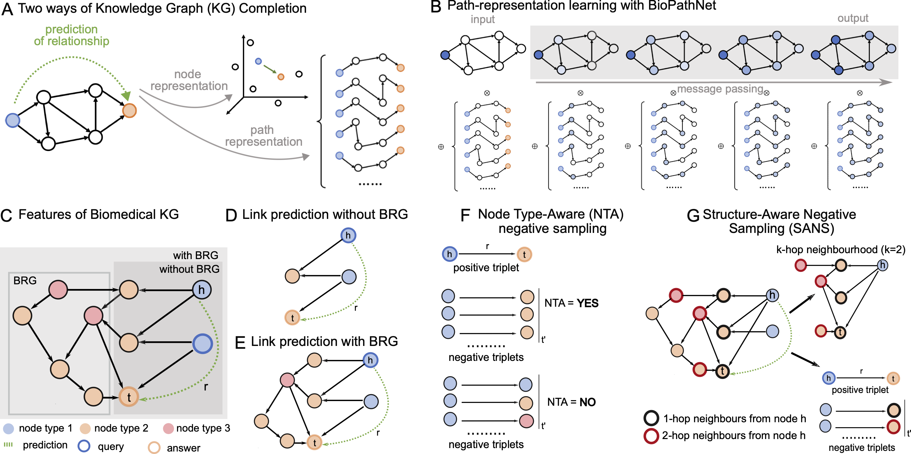

# BioPathNet: Link Prediction for Biomedical Knowledge Graphs #

This is the official codebase of the manuscript **Path-based reasoning for biomedical knowledge graphs with BioPathNet**

## Overview ##
BioPathNet is a graph neural network framework, adapted from [NBFNet][paper],
designed to reason on biomedical knowledge graphs. BioPathNet learns path representations
(instead of commonly used node embeddings) for the task of link prediction, 
specifically taking into account different node types and a 
background regulatory graph for message passing.


[paper]: https://arxiv.org/pdf/2106.06935.pdf



This codebase is based on [NBFNet][NBFNetgithub], PyTorch and [TorchDrug]. It supports training and inference
with multiple GPUs or multiple machines.

[TorchDrug]: https://github.com/DeepGraphLearning/torchdrug
[NBFNetgithub]: https://github.com/DeepGraphLearning/NBFNet

## Installation ##

You may install the dependencies via either conda or pip. Generally, BioPathNet works
with Python 3.7/3.8 and PyTorch version >= 1.8.0.

### From Conda ###

```bash
conda create -y -n biopathnet python=3.10
conda activate biopathnet

pip3 install --no-cache-dir torch==2.0.1+cu118 torchvision==0.15.2+cu118 torchaudio==2.0.2+cu118 -f https://download.pytorch.org/whl/torch_stable.html
pip install --no-cache-dir pyg_lib torch_scatter torch_sparse torch_cluster torch_spline_conv -f https://data.pyg.org/whl/torch-2.0.1+cu118.html

git clone https://github.com/DeepGraphLearning/torchdrug
cd torchdrug
pip install -r requirements.txt
python setup.py install
pip install ogb easydict pyyaml

pip install numpy==1.26.4 --force-reinstall
```


## Run ##

To run BioPathNet on mock data, use the following command. Alternatively, you
may use `--gpus null` to run BioPathNet on a CPU. Input files are train1 (BRG), train2 (supervision edges),
valid and test. Specify the absolute path of output dir and data dir in the config file.

```bash
python script/run.py -s 1024 -c config/knowledge_graph/mock/mockdata_run.yaml --gpus [0] 
```

## Predict ##
Predictions can be performed given a query node and query relation. Then all possible tail nodes (of same node type) 
will be ranked according to the prediction score. A prediction test file needs to be generated that specifies the query triplets.
The best way is have all unique (head, relation, tail), as as predictions are done over p(all_t of node_type(t) | h, r), 
as well as p(all_h of node_type(h)| given t, r-1). Important: the flag "remove_pos: no" needs to be set, else predictions will not
contain positive tails found in training.

```bash
python script/predict.py -c config/knowledge_graph/mock/mockdata_vis.yaml --gpus [0] --checkpoint dir/to/checkpoint/model_epoch_8.pth
```

## Visualize ##

For the visualization of the most important paths for a certain prediction, there is the option of detailing the top 10 paths
as text file or as subgraph figure. A prediction test file (test_vis.txt) needs to be generated that specifies the triplets to visualize.
Also node_colors_dict.txt specifies the colors used for different node types. Resulting visualizations (html files) can be opened with a
[static HTTP server](https://stackoverflow.com/questions/38497334/how-to-run-html-file-on-localhost). 

```bash
python script/visualize.py -c config/knowledge_graph/mock/mockdata_vis.yaml --gpus [0] --checkpoint dir/to/checkpoint/model_epoch_8.pth

python script/visualize_graph.py -c config/knowledge_graph/mock/mockdata_vis.yaml --gpus [0] --checkpoint dir/to/checkpoint/model_epoch_8.pth
```
