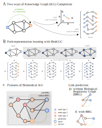

# BioKGC: Biomedical Knowledge Graph Completion #

This is the official codebase of the manuscript **BioKGC: Path-based reasoning in biomedical knowledge graphs**

## Overview ##
BioKGC is a graph neural network framework, adapted from [NBFNet][paper],
designed to reason on biomedical knowledge graphs. BioKGC learns path representations
(instead of commonly used node embeddings) for the task of link prediction, 
specifically taking into account different node types and a 
background regulatory graph for message passing.


[paper]: https://arxiv.org/pdf/2106.06935.pdf



This codebase is based on [NBFNet][NBFNetgithub], PyTorch and [TorchDrug]. It supports training and inference
with multiple GPUs or multiple machines.

[TorchDrug]: https://github.com/DeepGraphLearning/torchdrug
[NBFNetgithub]: https://github.com/DeepGraphLearning/NBFNet

## Installation ##

You may install the dependencies via either conda or pip. Generally, BioKGC works
with Python 3.7/3.8 and PyTorch version >= 1.8.0.

### From Conda ###

```bash
conda create -y -n biokgc python=3.10
conda activate biokgc
pip install --no-cache-dir torch torchvision torchaudio
pip install torch_scatter torch_sparse torch_cluster torch_spline_conv -f https://data.pyg.org/whl/torch-2.0.0+cpu.html
git clone https://github.com/DeepGraphLearning/torchdrug
cd torchdrug
pip install -r requirements.txt
python setup.py install
pip install ogb easydict pyyaml
```


## Run ##

To reproduce the results of BioKGC on mock data, use the following command. Alternatively, you
may use `--gpus null` to run NBFNet on a CPU.

```bash
python script/run.py -s 1024 -c config/knowledge_graph/mock/mockdata_run.yaml --gpus [0] 
```

## Predict ##
Predictions given a query node and query relation can be obtained and investigated for known and novel predictions. 

```bash
python script/predict.py -c config/knowledge_graph/mock/mockdata_vis.yaml --gpus [0] --checkpoint dir/to/checkpoint/model_epoch_8.pth
```

## Visualize ##

For the visualization of the most important paths for a certain prediction, there is the option of detailing the top 10 paths
as text file or as subgraph figure. 

```bash
python script/visualize_graph.py -c config/knowledge_graph/mock/mockdata_vis.yaml --gpus [0] --checkpoint dir/to/checkpoint/model_epoch_8.pth

python script/visualize.py -c config/knowledge_graph/mock/mockdata_vis.yaml --gpus [0] --checkpoint dir/to/checkpoint/model_epoch_8.pth```
```

More Details on execution in the sbatch directory.
